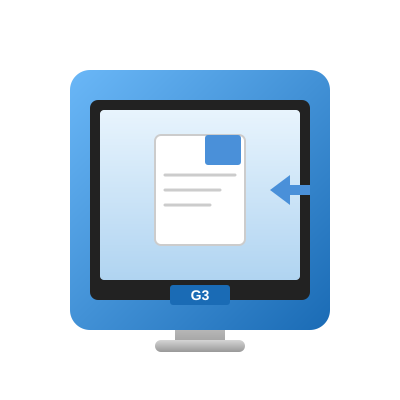

<picture>
  <source media="(prefers-color-scheme: dark)" srcset="app/static/logo.svg">
  
</picture>

# G3Files

Partage de fichiers entre un serveur moderne (Docker) et un client ancien (iMac G3, Mac OS 8.6) via câble RJ45.

## Fonctionnalités

- **Interface client** (`/`) — compatible Netscape 4, IE 5, Classilla (HTML 4.01, pas de JavaScript)
- **Interface admin** (`/admin`) — protégée par mot de passe (HTTP Basic Auth)
- **Téléchargement** de fichiers et dossiers (dossiers servis en `.tar.gz` généré à la volée)
- **Upload** de fichiers et dossiers via l'interface admin
- **Rafraîchissement automatique** toutes les 10 secondes (client)
- **Conteneurisation** Docker — un seul service, prêt en `docker compose up`

## Démarrage rapide

```bash
git clone https://github.com/ruhtrajer/G3Files.git
cd G3Files
docker compose up
```

Ouvrir `http://localhost:9929/` pour l'interface client.

## Interface admin

Accès : `http://localhost:9929/admin`

Identifiants par défaut : `admin` / `admin`

Le mot de passe peut être changé via la variable d'environnement `ADMIN_PASSWORD` :

```bash
ADMIN_PASSWORD=monmotdepasse docker compose up
```

## Structure du projet

```
G3Files/
├── docker-compose.yml       # Configuration Docker
├── Dockerfile               # Image Python/Flask
├── requirements.txt         # Dépendances (Flask uniquement)
├── app/
│   ├── server.py            # Serveur Flask (routes, auth, tar)
│   ├── templates/
│   │   ├── admin.html       # Interface d'administration
│   │   └── client.html      # Interface client
│   └── static/
│       └── logo.svg         # Logo du projet
└── shared/                  # Volume monté — fichiers partagés
```

## Routes

| Route | Méthode | Auth | Description |
|-------|---------|------|-------------|
| `/` | GET | Non | Page client — liste les fichiers partagés |
| `/admin` | GET | Oui | Page admin — gestion des fichiers |
| `/dl/<path>` | GET | Non | Téléchargement fichier ou dossier (.tar.gz) |
| `/admin/upload` | POST | Oui | Upload de fichier(s) ou dossier |
| `/admin/delete/<path>` | POST | Oui | Suppression d'un fichier ou dossier |

## Compatibilité client

L'interface client est conçue pour fonctionner sur :

- **Apple iMac G3** sous Mac OS 8.6 / 9
- **Netscape 4.x**
- **Internet Explorer 5.x**
- **Classilla** (navigateur moderne pour Mac OS 9)

Techniques utilisées :

- HTML 4.01 Transitional — pas de JavaScript
- Tableaux `<table>` avec attributs classiques (`border`, `cellpadding`)
- `<meta http-equiv="refresh" content="10">` pour l'auto-rafraîchissement
- Liens directs `<a href="/dl/...">` pour le téléchargement
- Icônes Unicode (fallback texte) — pas d'images ou CSS modernes

## Licence

MIT
